# MR 风险评估系统整体架构设计

## 1. 背景与目标

小红书每天有数百个服务变更上线，历史灰度平台积累了 200+ 问题拦截记录。目标是在研发提交 MR 时自动完成：

- 变更内容分析（代码、配置、依赖、接口、数据变更）
- 风险等级评估（可解释、可审计）
- 测试策略推荐（单测/集成/回归/性能/容灾/灰度观察）

系统优先满足“稳定、可解释、可扩展”，再逐步引入学习能力优化准确率。

## 2. 架构原则

- **解释优先**：所有风险结论必须带证据链，避免黑盒结论。
- **异步解耦**：MR 事件接入、分析、回写分离，抗高并发与峰值。
- **建议与门禁分层**：先建议后强制，减少误报对研发效率冲击。
- **渐进演进**：规则引擎为主、模型排序为辅，从 MVP 平滑过渡。

## 3. 分层架构与组件职责

### 3.1 Ingress 触发层

1. **WebhookGateway**
   - 输入：MR opened/updated/reopened 事件
   - 功能：鉴权、幂等、去重、限流
   - 输出：标准事件 `ChangeEvent`
2. **EventQueue**
   - 功能：削峰填谷、重试、死信队列
   - 输出：可并行消费的分析任务

### 3.2 Analyze 分析层

1. **ChangeNormalizer**
   - 统一事件模型：仓库、分支、作者、labels、base/head sha
2. **DiffFetcher**
   - 拉取 diff、文件列表、语言分布、变更规模统计
3. **ServiceMapper**
   - 通过路径规则、CODEOWNERS、构建图推断影响服务
4. **FeatureExtractors**
   - 提取特征：代码变更、依赖影响、关键度、历史模式、发布窗口
5. **KnowledgeRetriever**
   - 检索 200+ 历史拦截记录，返回相似案例证据

### 3.3 Decide 决策层

1. **RiskScoringEngine**
   - 计算风险分值和风险等级（L1-L4）
   - 输出分项贡献与 Top 风险驱动因素
2. **TestStrategyComposer**
   - 基于风险等级和触发信号推荐测试策略包
   - 输出建议用例、灰度策略、监控观察项
3. **PolicyGuardrails**
   - 组织规则与门禁策略（节假日窗口、关键链路强制要求）

### 3.4 Deliver 交付层

1. **ResultWriter**
   - 回写 MR 评论与 check 状态
   - 同步结构化结果到存储（便于统计与追踪）
2. **NotificationBridge**
   - 可选同步到发布平台/IM（高风险提醒）

### 3.5 Feedback 闭环层

1. **FeedbackCollector**
   - 收集人工标注（误报/漏报）与上线结果
2. **LearningOrchestrator**
   - 定期更新规则权重、阈值、案例标签，产出新版本

## 4. 端到端流程

```mermaid
flowchart LR
  mrEvent[MrWebhookEvent] --> ingress[WebhookGateway]
  ingress --> queue[EventQueue]
  queue --> normalize[ChangeNormalizer]
  normalize --> fetcher[DiffFetcher]
  fetcher --> mapper[ServiceMapper]
  mapper --> extract[FeatureExtractors]
  extract --> retrieve[KnowledgeRetriever]
  retrieve --> risk[RiskScoringEngine]
  risk --> strategy[TestStrategyComposer]
  strategy --> guard[PolicyGuardrails]
  guard --> writer[ResultWriter]
  writer --> mrPlatform[MrPlatform]
  deploySignals[PostDeploySignals] --> feedback[FeedbackCollector]
  feedback --> learn[LearningOrchestrator]
  learn --> retrieve
```

## 5. 数据模型（核心对象）

- `ChangeEvent`：MR 元信息、提交信息、base/head
- `FeatureVector`：标准化特征集合（含特征值、证据来源）
- `RiskAssessment`：风险等级、风险分数、分项解释
- `TestPlanRecommendation`：测试策略、灰度策略、监控项
- `FeedbackRecord`：人工标注与发布后结果（用于迭代）

## 6. SLA/SLO 设计

### 6.1 服务级目标

- **分析结果时延**
  - 快速结论：P95 <= 60s
  - 完整报告：P95 <= 180s
- **可用性**
  - 网关与回写链路：99.9%
  - 分析流水线：99.5%（允许降级）
- **吞吐目标**
  - 支持工作时段突发批量 MR（峰值 5x 常态）

### 6.2 质量目标

- 高风险召回率（L3/L4）：>= 85%
- 误报率（可人工标注校正）：首期 <= 25%，逐步优化到 <= 15%
- 解释完整率（有证据链的评估结果）：>= 98%

## 7. 可观测性设计

- **Metrics**
  - 队列积压、任务成功率、重试次数、平均分析耗时
  - 风险等级分布、规则命中率、误报/漏报趋势
- **Tracing**
  - 贯穿 `mr_id + head_sha` 的全链路追踪
- **Logging**
  - 结构化日志记录版本、特征、决策和异常上下文
- **Dashboard**
  - 研发效率视角（平均等待时长）
  - 质量视角（风险评估准确率、事故关联率）

## 8. 降级与容错策略

- 案例检索失败：降级为规则引擎结果，标记“案例证据缺失”
- 分析超时：先回写快速风险结论，再异步补全完整报告
- 回写失败：进入补偿队列，保证最终一致
- 外部依赖异常：输出“需要人工复核”的可见状态，避免静默失败

## 9. 安全与合规

- Webhook 签名校验 + 重放保护
- 最小权限访问仓库与平台 API
- 日志脱敏（token、密钥、用户隐私字段）
- 决策可审计（保留规则版本与模型版本）
