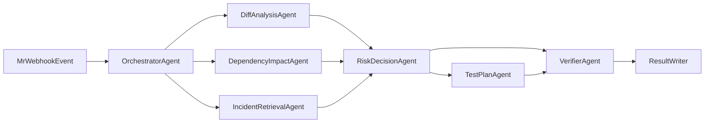

# Agent 化架构与 MCP 防撒谎设计

## 1. 目标

在原有 MR 风险评估系统基础上，升级为多 Agent 协作架构，并将“工具输出不可信（MCP 撒谎/幻觉）”作为核心风险治理对象。

## 2. 多 Agent 角色划分

- **OrchestratorAgent**
  - 负责任务拆分、执行顺序、预算控制、超时降级
- **DiffAnalysisAgent**
  - 负责代码变更理解、特征提取
- **DependencyImpactAgent**
  - 负责依赖图和影响面评估
- **IncidentRetrievalAgent**
  - 负责历史 200+ 拦截记录检索与证据匹配
- **RiskDecisionAgent**
  - 负责风险分级与解释输出
- **TestPlanAgent**
  - 负责测试策略推荐和灰度观察项生成
- **VerifierAgent**
  - 独立校验所有关键结论，阻断无证据推断

## 3. Agent Harness 运行机制

## 3.1 任务执行流

## 3.2 输出契约

每个 Agent 输出都必须包含：

- `claim`: 结论文本
- `evidence`: 可复核证据（文件、规则、案例、工具返回片段）
- `confidence`: 置信度（0-1）
- `source_type`: `tool_output` / `rule` / `inference`
- `verdict`: `verified` / `unverified`

没有证据的 claim 不能进入最终结果。

## 4. MCP 撒谎/幻觉防护策略

## 4.1 证据优先（Evidence-first）

- 所有 MCP 返回必须落盘为结构化原始记录（不可只保留摘要）
- Agent 结论必须引用证据 ID
- 未引用证据的结论自动降级为“假设”

## 4.2 双通道校验（Dual-path Validation）

- 对关键信息采用两个独立数据源交叉验证
  - 例如：依赖影响同时来自“代码依赖图”与“服务调用拓扑”
- 若结果冲突，标记 `conflict_state`，转人工复核

## 4.3 规则护栏（Policy Guardrails）

- 关键领域（支付、权限、数据迁移）禁止“无证据低风险”判定
- 存在 hard rule 命中时，模型/Agent 不可降级风险等级

## 4.4 不确定性显式化（Uncertainty Exposure）

- 输出字段 `unknowns`：列出缺失信息与潜在影响
- 输出字段 `assumptions`：列出前提条件
- 对 `unknowns` 超阈值的结果强制标记 `needs_manual_review`

## 4.5 重放与审计（Replay & Audit）

- 每次评估保留 `input snapshot + tool outputs + agent trace + decision`
- 支持离线重放，复现“为什么当时给这个等级”
- 定期抽样审计 Agent 输出真实性

## 5. 可信评分机制（Truth-aware Risk）

在原风险分数基础上引入可信因子 `trust_score`：

- `risk_score_final = base_risk_score * trust_score_adjustment`
- 若关键证据未验证，`trust_score_adjustment` 上调风险（更保守）
- 若证据冲突，直接抬升到至少 L3 并要求人工确认

示例：

- 证据完整且一致：`trust_score_adjustment = 1.0`
- 证据缺失：`trust_score_adjustment = 1.15`
- 证据冲突：`trust_score_adjustment = 1.30`

## 6. 失败降级策略

- MCP 超时/异常：降级为规则引擎 + 已有静态特征
- 验证器失败：输出“仅建议，不可门禁”
- 冲突过多：进入人工审核通道，附冲突清单

## 7. 关键指标（面向防撒谎）

- `evidence_coverage_rate`: 结论中有证据支撑的比例
- `verification_pass_rate`: 通过 Verifier 的 claim 比例
- `conflict_rate`: 双通道冲突比例
- `manual_review_rate`: 被转人工复核比例
- `postmortem_false_claim_rate`: 复盘确认的错误结论比例

## 8. 落地建议

- 先上线单一 `VerifierAgent`，再逐步增加多验证器
- 先做高风险领域（支付/数据）强验证，再向全量推广
- 把“证据链完整率”作为上线门槛，而不是只看准确率
